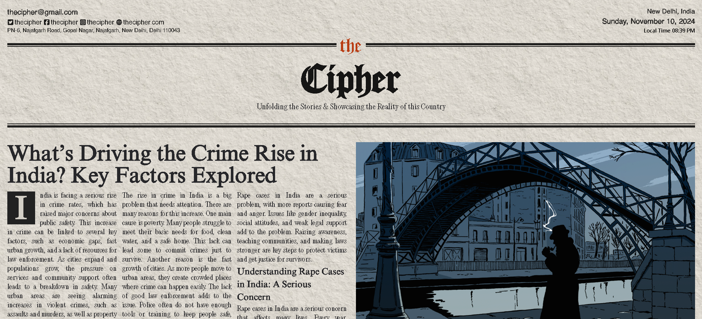

# *TheCipher* 📰



**TheCipher** is a nostalgic, front-end web application that emulates the look and feel of a 90s-era newspaper. Built with TypeScript, this project revives the vintage charm of print media with a classic UI, perfect for displaying articles, stories, or custom content in an old-school aesthetic.

## Features

- **Vintage Newspaper UI**: Experience a retro look with fonts, layout, and styles reminiscent of the 90s.
- **Modern Tech Stack**: Developed with Next.js, React, and TypeScript for a clean, maintainable codebase.

## Tech Stack

- **Next.js** and **React** for component-based design
- **TypeScript** for type-safe, maintainable code
- **CSS Modules** and **TailwindCSS** for custom styling

## Getting Started

1. **Clone the Repository**:
    ```bash
    git clone https://github.com/yourusername/TheCipher.git
    cd TheCipher
    ```

2. **Install Dependencies**:
    ```bash
    npm install
    ```

3. **Run the Application**:
    ```bash
    npm run dev
    ```

4. **Open in Browser**:
   Visit `http://localhost:5173` to view the project locally.

## Contributing
Contributions are welcome! Please fork the repository, create a new branch, and submit a pull request.
